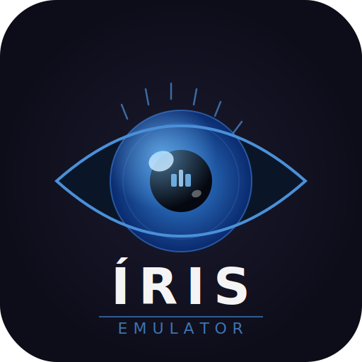

# Íris Emulator

<p align="center">
  
</p>

<p align="center">
  <b>Multi-system Atari emulator — Atari 2600 + Atari Lynx</b><br>
  Built with C++17 · Qt 6 · SDL2 · Gearlynx engine<br>
  Developed by <b>Gorigamia</b> · Open Source · Constantly updated
</p>

<p align="center">
  <a href="https://github.com/gorigamia/iris-emulator/releases/tag/v1.17">
    
  </a>
  
  
  
</p>

---

## What is Íris?

Íris is an open source multi-system Atari emulator that runs **Atari 2600** and **Atari Lynx** games on modern Windows hardware. The interface is inspired by **PCSX2**, **DuckStation**, and **Dolphin Emulator** — clean, professional, and easy to use without sacrificing power user features.

The project is in **active development** and receives constant updates. New mappers, better game compatibility, Lynx improvements, and quality of life features are always in progress.

> **ROMs and BIOS files are NOT included and cannot be provided.**
> You must own the original hardware to legally use ROM files.
> The Atari Lynx Boot ROM (`lynxboot.img`) must be obtained from your own Lynx hardware.

---

## Platform Support

| Platform | Status |
|---|---|
| Windows 10 64-bit | ✅ Supported |
| Windows 11 64-bit | ✅ Supported |
| Linux | ⚠️ Not officially supported yet |
| macOS | ❌ Not supported |

> **Linux contributors welcome!**
> The codebase uses Qt6, SDL2, and CMake — all cross-platform. I don't have Linux experience to port it myself, but if you do, pull requests are very welcome. The main things that would need attention are the build system paths, the icon theme loading, and the SDL audio device enumeration.

---

## Credits

This emulator would not exist without the work of these incredible people:

### Atari 2600
The 2600 core was built from scratch, but heavily informed by the community's decades of reverse engineering work. Special thanks to the **Stella** emulator team and the **AtariAge** community for their documentation of the TIA, RIOT, and 6507 chips.

### Atari Lynx — Gearlynx
The Lynx core is powered by **[Gearlynx](https://github.com/drhelius/Gearlynx)** by **Ignacio Sanchez (drhelius)** — a high-accuracy, open source Atari Lynx emulator. Without Gearlynx, Lynx support in Íris would not be possible. All Lynx emulation credit goes to him.

---

## Features

### Atari 2600
- Cycle-accurate 6507 CPU (all illegal opcodes)
- TIA chip at color-clock level — 15 collisions, HMOVE, WSYNC, VDEL, NUSIZ
- 2-channel audio with 16 waveforms
- RIOT 6532 (timers + I/O)
- NTSC / PAL / SECAM support
- Mappers: None (≤4KB), F8 (8KB), F6 (16KB), F4 (32KB), E0 (Parker Bros), F8SC/F6SC/F4SC (Superchip)

### Atari Lynx (powered by Gearlynx)
- WDC 65C02 CPU @ 4 MHz
- Mikey chip — 8 timers, 4-channel stereo audio, display DMA
- Suzy sprite engine with scaling
- Math coprocessor (multiply/divide)
- 160×102 4bpp display with palette
- LNX cartridge format + HLE boot (no BIOS required for homebrew)
- Boot ROM support (`lynxboot.img`) for commercial games

### Interface
- Game list with cover art (table + grid view)
- Built-in cover art downloader (TheGamesDB)
- CRT scanlines, CRT Full (phosphor + RGB mask + vignette), LCD Grid, LCD Ghosting filters
- Dark theme (inspired by PCSX2)
- Fully remappable controls — keyboard and gamepad
- 10 save state slots per game
- Drag & drop ROM loading
- Fullscreen support
- Pause overlay menu
- Discord Rich Presence (game name, console, time playing, status)
- Debug window (F12)
- Settings with per-console video options
- **Discord Rich Presence** — shows game name, console (Atari 2600 / Atari Lynx), time playing, and status (playing / paused / in menu)

---

## Game Compatibility

### Atari 2600 — Works perfectly ✅

| Game | Status |
|---|---|
| Pitfall! | ✅ Perfect |
| River Raid | ✅ Perfect |
| Space Invaders | ✅ Perfect |
| Pac-Man | ✅ Perfect |
| Enduro | ✅ Perfect |
| Frostbite | ✅ Perfect |
| Atlantis | ✅ Perfect |
| Demon Attack | ✅ Perfect |
| Megamania | ✅ Perfect |
| Keystone Kapers | ✅ Perfect |
| Berzerk | ✅ Perfect |
| Adventure | ✅ Perfect |
| Combat | ✅ Perfect |
| Asteroids | ✅ Perfect |
| Missile Command | ✅ Perfect |
| Centipede | ✅ Perfect |
| Freeway | ✅ Perfect |
| Donkey Kong | ✅ Perfect |
| Frogger | ✅ Perfect |
| H.E.R.O. | ✅ Perfect |
| Solaris | ✅ Perfect |
| Jr. Pac-Man | ✅ Perfect |
| Crystal Castles | ✅ Perfect |
| Montezuma's Revenge | ✅ Perfect |
| Q*bert | ✅ Perfect |
| Popeye | ✅ Perfect |
| Spider-Man | ✅ Perfect |
| Star Wars: The Empire Strikes Back | ✅ Perfect |
| The Activision Decathlon | ✅ Perfect |

| Game | Issue |
|---|---|
| Cosmic Ark | Stars don't appear (timing edge case) |
| Yars' Revenge | Shield flicker more intense than hardware |
| BurgerTime | E7 mapper simplified — some graphics glitch |
| Masters of the Universe | Minor visual artifacts |
| H.E.R.O | Loud, deafening sound and black screen. Avoid opening |


### Atari 2600 — Not working ❌

| Game | Reason |
|---|---|
| Pitfall II | DPC mapper not implemented |
| Miner 2049er | 3F mapper not implemented |
| Decathlon (paddle version) | Paddle controller not implemented |
| Robot Tank | FA mapper not implemented |
| Supercharger games | AR mapper not implemented |
| Kaboom! | Paddle controller not implemented |
| Night Driver | Paddle controller not implemented |
| Indy 500 | Driving controller not implemented |

**Missing mappers:** 3F, 3E, FE, FA, F0, AR, DPC, DPC+, UA, CV

---

### Atari Lynx — Works well ✅

| Game | Status |
|---|---|
| California Games | ✅ Playable |
| Chip's Challenge | ✅ Playable |
| Gates of Zendocon | ✅ Playable |
| Xenophobe | ✅ Playable |
| Batman Returns | ✅ Playable |
| Lemmings | ✅ Playable |
| Toki | ✅ Playable |
| Alien vs Predator (Prototype) | ✅ Playable |
| Awesome Golf | ✅ Playable |
| Double Dragon (Telegames) | ✅ Playable |
| Paperboy | ✅ Playable |
| RoadBlasters | ✅ Playable |
| Simple homebrew titles | ✅ Playable |

### Atari Lynx — Has issues ⚠️

| Game | Issue |
|---|---|
| Gauntlet: The Third Encounter | Heavy graphical bugs, mostly unplayable |
| Games with heavy sprite overlap | Collision detection incomplete |
| Games using ComLynx | Multiplayer not implemented |
| Games with sprite tilt/stretch | Advanced sprite transforms missing |

> **Note:** Only a portion of the Lynx library has been tested. If a game not listed here runs well or has issues, feel free to open an issue or pull request on GitHub.

### Atari Lynx — Not working ❌

| Game | Reason |
|---|---|
| Games requiring CPUSLEEP | Not implemented |
| Games using shadow/XOR/boundary sprites | Advanced sprite types missing |

> The Lynx core is in **alpha (~30%)** and improving with every release.

---

## Hardware Requirements

Rendering is **100% software** (QPainter/QImage). No GPU required beyond desktop display.
Emulation is **single-threaded** — 1 core for emulation + 1 for SDL audio.

### Minimum — Atari 2600 (60 FPS)

| | Requirement |
|---|---|
| **CPU (Intel)** | Intel Core 2 Duo E6300 @ 1.86 GHz (2006) |
| **CPU (AMD)** | AMD Athlon 64 X2 3800+ @ 2.0 GHz (2006) |
| **RAM** | 2 GB DDR2-667 |
| **GPU (dedicated)** | NVIDIA GeForce 6200 / AMD Radeon X1300 |
| **GPU (integrated)** | Intel GMA 950 (Intel 945G chipset, 2005) |
| **Storage** | 80 MB |
| **OS** | Windows 10 64-bit |
| **Display** | 1024×768 |

### Minimum — Atari Lynx (75 FPS)

| | Requirement |
|---|---|
| **CPU (Intel)** | Intel Core 2 Duo E8400 @ 3.0 GHz (2008) |
| **CPU (AMD)** | AMD Phenom II X2 550 @ 3.1 GHz (2009) |
| **RAM** | 2 GB DDR2-800 |
| **GPU (dedicated)** | NVIDIA GeForce 8400 GS / AMD Radeon HD 2400 |
| **GPU (integrated)** | Intel GMA X4500 (Intel G45 chipset, 2008) |

### Recommended — Both consoles

| | Requirement |
|---|---|
| **CPU (Intel)** | Intel Core i3-2100 @ 3.1 GHz (Sandy Bridge, 2011) |
| **CPU (AMD)** | AMD FX-6300 @ 3.5 GHz (2012) |
| **RAM** | 4 GB DDR3-1333 |
| **GPU (dedicated)** | NVIDIA GeForce GTX 550 Ti / AMD Radeon HD 6790 |
| **GPU (integrated)** | Intel HD Graphics 2000 (Sandy Bridge, 2011) |
| **Storage** | 200 MB (with covers) |
| **OS** | Windows 10 / 11 64-bit |
| **Display** | 1280×720 or higher |

---

## Default Controls

| Action | 2600 Keyboard | 2600 Gamepad | Lynx Keyboard | Lynx Gamepad |
|---|---|---|---|---|
| Directions | Arrow keys | D-pad / Left stick | Arrow keys | D-pad / Left stick |
| Button 1 / A | Z | A | Z | A |
| Button 2 / B | — | — | X | B |
| L Shoulder | — | — | A | LB |
| R Shoulder | — | — | S | RB |
| Select | Tab | Back | — | — |
| Reset / Start | Backspace | Start | Enter | Start |

All bindings are remappable in Settings → Controls.

---

## Running (Windows)

1. Download the latest release from the [Releases page](https://github.com/Adoregabriel2005/iris-emulator/releases)
2. Extract the zip to any folder
3. Run `irisemulator.exe`
4. On first launch you will be asked to add a ROM folder
5. Double-click any game to play

**Requirements to run:**
- Windows 10 or 11 64-bit
- [Visual C++ Redistributable 2022 x64](https://aka.ms/vs/17/release/vc_redist.x64.exe) (if not already installed)
- Discord desktop app (optional, for Rich Presence)

> **Linux / macOS:** Not officially supported yet. The code is cross-platform (Qt6 + SDL2 + CMake) and Linux contributions are very welcome. See the Build from Source section.

---

## Build from Source

### Requirements
- Windows 10/11 64-bit
- [Visual Studio 2022](https://visualstudio.microsoft.com/) with C++ workload
- [Qt 6.8+](https://www.qt.io/download) (Widgets, Svg, Network)
- [SDL2](https://github.com/libsdl-org/SDL/releases)
- [vcpkg](https://github.com/microsoft/vcpkg) with `discord-rpc:x64-windows`
- CMake ≥ 3.16

### Steps

```powershell
# Clone
git clone https://github.com/gorigamia/iris-emulator.git
cd iris-emulator

# Configure
cmake -S . -B build -DCMAKE_TOOLCHAIN_FILE="D:/vcpkg/scripts/buildsystems/vcpkg.cmake"

# Build
cmake --build build --config Release

# Output
# build/Release/irisemulator.exe
```

### Gearlynx (Lynx engine)
The Lynx core requires the Gearlynx source files in `build/src/`.
Download [Gearlynx](https://github.com/drhelius/Gearlynx) and place the `src/` contents in `build/src/`.

### Cover art downloader (optional)
```powershell
pip install -r tools/requirements.txt
python tools/fetch_boxarts.py --folder "C:\roms" --out "C:\roms\covers"
```

---

## Usage

1. Open `irisemulator.exe`
2. On first launch, you will be asked to add a ROM folder
3. `.bin` / `.a26` / `.rom` → Atari 2600 · `.lnx` / `.lyx` → Atari Lynx
4. Double-click any game to play

**Atari Lynx BIOS:** Place `lynxboot.img` next to the `.exe` or configure the path in Settings → Lynx Controls → Boot ROM file.
ROMs with the HLE magic byte (`$80`) will boot without a BIOS.

**Save States:** Gear menu → Save/Load State (slots 1–10) or toolbar buttons

---

## License

Íris Emulator is open source software licensed under the **GNU General Public License v3.0**.
See [LICENSE](LICENSE) for details.

The Gearlynx engine is copyright © 2025 Ignacio Sanchez, also licensed under GPL-3.0.

---

## About

Developed by **Gorigamia** · Inspired by PCSX2, DuckStation, and Dolphin Emulator
